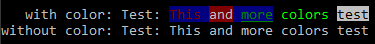
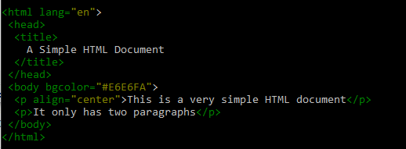

# Lyx

Lyx is a library of handfull PHP classes and functions. This is by no means a "perfect" PHP implementation; it's a collection of classes and functions that I've wrote over many years and its' origin is back at PHP 5.2, so there are still parts of code that need to be rewritten, modified or totally deleted. The main reason for publishing it, is because I need a quick way to install it using composer.

## Requirements

PHP needs to be a minimum version of PHP 7.1.0. It's began with PHP 5.2 when I started building it, but there is no point supporting older versions < 7.1 of PHP. Some parts of the code may be in older PHP code style/methods, but I'll fix all those library parts maybe with the help of some other people that may be intersting or find itr useful.

## Installation

### Using composer

```bash
composer require clytras/lyx
```

### Downloading (not using autoloader)

Include the `src/autoload.php` just once.

## Tests

Test cases are not implemented yet, but there will be detailed and full feature tests using [PHPUnit](https://phpunit.de/) testing library.

## Examples

Examples are located inside the `\examples` directory. There are currently not many example cases covered, but there will be more added in the future.

- `Lyx\Strings\Str::format($text, $params = [], $options = false)`<br>
`Str::format` params, support single array, associative  nested arrays and even constants. Single array params are supported by numbers representing element index ex. `{0}`, `{1}` etc. Associative  array params can be nested named like `{param.arg1}`. It supports numbers zero padding like `{0,5}` will produce `00123` when a number `123` will be passed. Floating point precision is supported like `{0,.4}` will produce `123.4500` when a number `123.45` will be passed. Padding and floating point precision can be combined like `{0,5.4}` will produce `00123.4500` when `123.45` passed. There is no floating point precision round methods implent yet but there will be added in the future. If we want to separate thousands using thousands separator, we add a slash after the zero padding number like `{0,/.2}` will produce `10,000.00` with the number `10000`. It also converts numbers to hexadecimal, octal and binary formats using `X` (or `x` for lowercase) for hex, `O` for octal and `B` for binary like `{0:X}` will produce `FE0` when `0xfe0` or `4064` will be passed; `111111100000` with `{0:B}`. Number converters also support zero padding `{0:x,6}` will produce `000fe0` when `4064` passed.

```PHP
// Simple Str::format example

Lyx\Strings\Str::format("This is a simple {0} for {1} ('{0}', '{1}')", [
  'format',
  'testing'
]));

// This is a simple format for testing ('format', 'testing')
```

```PHP
// Using assosiative arrays and constants

use Lyx\Strings\Str;

define("C_TEST", 'Const test!');

lyx_print(Str::format(
  "This is an assoc keys {example} for {purpose} [{C_TEST}] ('{example}', '{purpose}')",
  [
    'example' => 'Case',
    'purpose' => 'Testing'
  ]
));

// This is an assoc keys Case for Testing [Const test!] ('Case', 'Testing')
```

```PHP
// Using assosiative nested arrays

use Lyx\Strings\Str;

lyx_print(Str::format(
  "This is an assoc keys {example.arg1} for {purpose.a1} ('{example.arg2}', '{purpose.a2}')",
  [
    'example' => [
      'arg1' => 'Example - Arg 1',
      'arg2' => 'Ex - Arg 2'
    ],
    'purpose' => [
      'a1' => 'Testing 1',
      'a2' => 'Test 2'
    ]
  ]
));

// This is an assoc keys Example - Arg 1 for Testing 1 ('Ex - Arg 2', 'Test 2')
```

```PHP
// Numbers zero padding, decimal point precision and converters

use Lyx\Strings\Str;

$nums = [123, 1.23, 19000321, 0xEE, 0xA5F];
$numCases = [
  'single_numbers' => [
    'format' => "{0} / {1} / {2}"
  ],
  'zero_padding/dec_point = ./thousand_sep = ,' => [
    'format' => "{0,.3} / {1,3.4} / {2,/.2}",
    'options' => [
      'dec_point' => ',',
      'thousands_sep' => '.'
    ]
  ],
  'zero_padding/dec_point = ,/thousand_sep = .' => [
    'format' => "{0,.3} / {1,3.4} / {2,/.2}"
  ],
  'base/hex' => [
    'format' => "{3:x} / 0x{3:X,6} / {4:x} / 0x{4:X,4}"
  ],
  'base/oct' => [
    'format' => "{3:o} / 0{3:o,5} / {4:o} / 0{4:o,4}"
  ],
  'base/bin' => [
    'format' => "{3:b} / 0b{3:b,8} / {4:b} / 0b{4:b,16}"
  ]
];

foreach($numCases as $name => $case) {
  echo "{$name}: ";
  lyx_println(Str::format($case['format'], $nums, $case['options'] ?? []));
}
```
##### OUTPUT
```bash
> single_numbers: 123 / 1.23 / 19000321
> zero_padding/dec_point = ./thousand_sep = ,: 123,000 / 001,2300 / 19.000.321,00
> zero_padding/dec_point = ,/thousand_sep = .: 123.000 / 001.2300 / 19,000,321.00
> base/hex: ee / 0x0000EE / a5f / 0x0A5F
> base/oct: 356 / 000356 / 5137 / 05137
> base/bin: 11101110 / 0b11101110 / 101001011111 / 0b0000101001011111
```

- `Lyx\System\Terminal`<br>
`Terminal` class can be used to output colored format text to terminals. It uses a very simple format for setting foreground, background colors and attributes. The format for coloring is `<f:[color-name]>` for foreground color, `<b:[color-name]>` for background color and `<a:[attr-name]>` for setting attributes. The colors are hierarchical, which means they open and close in hierarchiwal manner; the attributes just set and unset using the minus sign `-` infront the attribute name we want to unset. For example `<f:yellow,b:blue,a:underline>` will set the foreground color to yellow and background color to blue; we can open an other tag to add a color to the stack, `<b:cyan>` will set the background color to cyan and when we call `<b>` it will go back to blue where it was set before the cyan color; we can just close one tag to reset or go back; `<f>` will go back one foreground color, `<b>` will go back one background color, `<a:-underline>` will clear the underline attribute, `<a>` will reset all attributes, and `<>` will reset everything to defaults.

```PHP
// Using simple color formating or print removing the formating tags

use Lyx\System\Terminal;

$str = 'Test: <f:red,b:blue>This<f> <b:red>and<b> <f:green,a:underline>more<> <f:light-green>colors<f> <a:reverse:underline>test<a>';

// Print the text with terminal color formating
Terminal::println($str);

// Print the raw text without color formating tags
Terminal::printlnRaw($str);
```
##### OUTPUT


```PHP
// Using templates to set color formating with regular expressions

use Lyx\System\Terminal;

$html = <<<HTML
<html lang="en">
 <head>
  <title>
    A Simple HTML Document
  </title>
 </head>
 <body bgcolor="#E6E6FA">
  <p align="center">This is a very simple HTML document</p>
  <p>It only has two paragraphs</p>
 </body>
</html>
HTML;

Terminal::printTmpl($html, [
  // Use green to color all the tags
  '/<(.|\\n)*?>/' => 'f:green',

  // Use yellow to collor tags attribute values
  '/(?:\<\!\-\-(?:(?!\-\-\>)\r\n?|\n|.)*?-\-\>)|(?:<(\S+)\s+(?=.*>)|(?<=[=\s])\G)(?:((?:(?!\s|=).)*)\s*?=\K\s*?[\"\']?((?:(?<=\")(?:(?<=\\\\)\"|[^\"])*|(?<=\')(?:(?<=\\\\)\'|[^\'])*)|(?:(?!\"|\')(?:(?!\/>|>|\s).)+))[\"\']?\s*)/m' => 'f:yellow',
]);
```
##### OUTPUT


## API List

For now there is just an [API list](doc/APIList.md) with all functions and classes. Maybe there will be a more detailed and documented navigation wised page in the future.

## License

BSD-3-Clause

Copyright 2019 Lytras Christos

Redistribution and use in source and binary forms, with or without modification, are permitted provided that the following conditions are met:

1. Redistributions of source code must retain the above copyright notice, this list of conditions and the following disclaimer.

2. Redistributions in binary form must reproduce the above copyright notice, this list of conditions and the following disclaimer in the documentation and/or other materials provided with the distribution.

3. Neither the name of the copyright holder nor the names of its contributors may be used to endorse or promote products derived from this software without specific prior written permission.

THIS SOFTWARE IS PROVIDED BY THE COPYRIGHT HOLDERS AND CONTRIBUTORS "AS IS" AND ANY EXPRESS OR IMPLIED WARRANTIES, INCLUDING, BUT NOT LIMITED TO, THE IMPLIED WARRANTIES OF MERCHANTABILITY AND FITNESS FOR A PARTICULAR PURPOSE ARE DISCLAIMED. IN NO EVENT SHALL THE COPYRIGHT HOLDER OR CONTRIBUTORS BE LIABLE FOR ANY DIRECT, INDIRECT, INCIDENTAL, SPECIAL, EXEMPLARY, OR CONSEQUENTIAL DAMAGES (INCLUDING, BUT NOT LIMITED TO, PROCUREMENT OF SUBSTITUTE GOODS OR SERVICES; LOSS OF USE, DATA, OR PROFITS; OR BUSINESS INTERRUPTION) HOWEVER CAUSED AND ON ANY THEORY OF LIABILITY, WHETHER IN CONTRACT, STRICT LIABILITY, OR TORT (INCLUDING NEGLIGENCE OR OTHERWISE) ARISING IN ANY WAY OUT OF THE USE OF THIS SOFTWARE, EVEN IF ADVISED OF THE POSSIBILITY OF SUCH DAMAGE.
